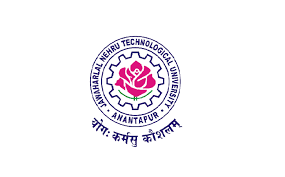

# 👨‍💻 Manoj Kumar Vallabhaneni

**Aspiring Data Analyst**, **Data Engineer**, and **Data Scientist**  
Passionate about Data-Driven Decision Making 🚀

---

## ✨ Profile Highlights
- 📌 2.5+ years of experience in data analytics, visualization, and ETL pipeline development  
- 🔄 Hands-on with end-to-end data workflows — from ingestion to visualization  
- 🏢 Experience across academic, corporate, and cloud-native data environments  
- 🤖 Strong foundation in AI and machine learning with practical applications  
- 📈 Passionate about storytelling with data, continuous learning, and scalable systems  
- 🗣️ Excellent communicator with experience explaining data insights to non-technical stakeholders and cross-functional teams  

---

## 🚀 Tools & Platforms

---

## 📊 Technical Skills

- **Programming:** Python, SQL, R, Java  
- **Libraries:** NumPy, Pandas, SciPy, Seaborn, Matplotlib, Scikit-Learn  
- **Databases:** MySQL, MongoDB  
- **Visualization Tools:** Power BI, Tableau, Microsoft Excel  
- **Cloud Platforms:** AWS, Azure, GCP  
- **ML Techniques:** Regression, KNN, Decision Tree, Naive Bayes, Random Forest  
- **Other Tools:** Git, VS Code, dbt, SAS  
- **Processes:** SDLC, Agile, Waterfall
- **Data Engineering:** ETL, Data Wrangling, Data Warehousing, Data Cleaning, Statistical Modelling
  
---

## 💼 Professional Experience

### 🎓 Graduate Teaching Assistant — *Eastern Kentucky University*  
*Aug 2023 – Dec 2024 | Richmond, KY*

- 📘 Maintained academic data systems to track attendance and grades, improving accuracy and insights  
- 🛠️ Designed workshop material and assisted faculty in courses involving Python and data visualization tools  
- 👨‍🏫 Provided one-on-one tutoring, improving student performance by 20%  
- 📊 Boosted classroom engagement by 15% through structured academic mentoring and support sessions  
- 🔬 Supported research activities involving data cleaning, visualization, and statistical modeling using R and Python  

---

### 🧑‍💻 Software Engineer — *Persistent Systems Ltd.*  
*Jul 2022 – Jul 2023 | Pune, India*

- 🏗️ Designed and deployed scalable ETL pipelines in **Snowflake** using **dbt**, reducing data processing time by 30%  
- ⚙️ Tuned Snowflake configurations to boost warehouse performance and reduced compute cost by 25%  
- 📊 Developed robust dashboards in **Power BI** using **DAX** and **Power Query** for real-time decision-making  
- 🔄 Automated manual reporting workflows and improved data refresh cycle by 40%  
- 🤝 Collaborated with analysts and business users to refine KPIs, troubleshoot bugs, and drive continuous improvement  

---

## 🧪 Academic Projects

### 📊 Visualization of Titanic Dataset *(R, ggplot2)*

- 🔍 Performed exploratory data analysis (EDA) on the Titanic dataset using **R**, focusing on survival patterns  
- 📊 Used **ggplot2** and **dplyr** to create bar charts, histograms, and faceted plots  
- 📈 Summarized key statistics and visual comparisons to communicate insights clearly  
- 👥 Highlighted how socio-economic and demographic factors influenced survival outcomes  

---

### 💡 Medical Insurance Premium Prediction *(Python, Scikit-learn)*

- 🧼 Cleaned and preprocessed health insurance datasets using **one-hot encoding**, **scaling**, and **imputation**  
- 🧠 Built regression models: **Polynomial**, **Decision Tree**, **Random Forest**, and **KNN**  
- 📉 Evaluated accuracy and visualized model outputs in stakeholder-friendly formats  
- 💬 Delivered insights through dashboards to help non-technical users make informed decisions  

---

## 🎓 Education

    
   
  🎓 **Master of Science in Artificial Intelligence**  
  *Eastern Kentucky University ( December 2024)*

    
   
  🎓 **Bachelor of Technology in Computer Science and Engineering**  
  *Jawaharlal Nehru Technological University Anantapur (July 2022)*

---

## 📜 Certifications

  
   
  
   
  

---

## 🔗 Let's Connect

  
  
  
  
  

> 💡 *"Data is the new oil – let’s refine it for insights."*

---
